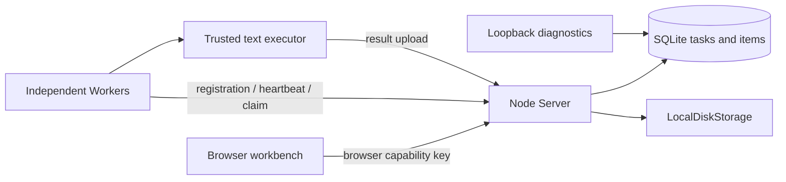

# AutoHub Community

**Turn spare Windows PCs into a small self-hosted Worker cluster.**

Submit a batch, follow each file, and collect results from your own machines. Derived from a real internal workflow, with a deliberately small local community runtime.

[中文说明](README.zh-CN.md) · [Architecture](docs/architecture.md) · [Executor API](docs/executor-api.md)

**Status: unreleased candidate.** Local Windows validation is recorded; clean standard-user acceptance and hosted CI are still release gates. No public release is claimed.


- SQLite queue with atomic task claims and per-file status.
- Independent Workers with registration, heartbeats and task takeover after interruption.
- Explicit item retry that preserves already successful items.
- Local input/result storage with bounded uploads and generated file identities.
- Browser workbench and a separate loopback-only diagnostics endpoint.
- A small UTF-8 text executor you can inspect and extend.

## Five-minute local demo

Install Node.js **22.23.2** x64 and Git on Windows 11. Run in a new, writable folder (spaces are supported):

```powershell
git clone https://github.com/a844417934-coder/autohub-community.git
cd autohub-community
npm ci --registry=https://registry.npmjs.org
npm run build
npm run demo
```

The clone URL above is the intended publication target; it is not available while this candidate is unpublished. For local candidate evaluation start at its extracted directory and run the last three commands.

Demo generates random keys and tiny synthetic text files in a new temporary directory, starts a Server and a separate Worker, verifies downloaded results, and prints the workbench URL and temporary browser key. Open that URL and paste the key to see real tasks. Ctrl+C stops the demo and removes its temporary directory. It does not install services or modify network settings. Package installation needs the npm registry; the running demo only calls loopback.

For a smoke test that exits by itself: `npm run demo:smoke`.

## Keep a local workspace

```powershell
npm run setup
npm start
```

In another terminal in the same folder:

```powershell
npm run worker -- .local/config.json demo-worker
```

Open [the local workbench](http://127.0.0.1:43170), paste `browserKey` from `.local/config.json`, and choose **Run synthetic demo**. Keep that file private. Setup refuses to overwrite an existing configuration. Workspace files persist until you explicitly remove the stopped local workspace.

## Architecture



Scheduling is **task-level**: one Worker owns a task and processes its pending items. It does not automatically distribute one task's items across PCs. A 15-second heartbeat timeout requeues interrupted work. Recovery is **at-least-once**: an interrupted task can be executed again. Executors with side effects must supply their own idempotency. Explicit failed-item retry preserves completed items.

## Support and boundaries

| Environment | Current evidence |
| --- | --- |
| Windows 11 x64, Node 22.23.2 | Local install/build/tests, separate-process demo and two-Worker recovery verified |
| Clean Windows standard account | Pending; required before publication |
| Windows 10 | Not yet tested |
| Linux/macOS | Not claimed supported |
| Node 24 | Not a supported release target |

**Trusted LAN only / not internet hardened.** Server defaults to loopback. Admin always binds loopback. LAN binding is an explicit configuration change and is not yet a separately validated support claim. Browser access uses one random shared capability key: this is single-user/trusted-team access, not login or RBAC. Worker enrollment requires a separate random key, then process sessions and task leases. Missing Worker key disables the Worker channel. Do not expose HTTP keys or file contents to an untrusted network. See [configuration](docs/configuration.md) and [security](SECURITY.md).

Uploads are 1–65,536 bytes, at most 16 files per task. Filenames are labels; storage paths use generated task IDs and indexes. The demo accepts UTF-8 and produces a JSON text summary. No arbitrary commands, external executor paths or client-selected directories are accepted.

## Extend and contribute

Implement a trusted local function following [executor-api.md](docs/executor-api.md), add the tool to the Server and Worker allowlists, and test actual file results. Never load executor code from a task payload.

```js
// Fixed code chooses paths inside a per-item workspace.
await executeText({ workspace, inputName: 'input.txt', outputName: 'result.txt' });
```

Run `npm run check`, `npm test`, `npm run build` and `npm run demo:smoke`. See [CONTRIBUTING](CONTRIBUTING.md) and [troubleshooting](docs/troubleshooting.md).

## Limits and roadmap

One Server process owns one database; one active task per Worker. No tenant isolation, general-purpose execution sandbox, transport TLS, storage quota, automatic workspace retention, cancellation API or large-file streaming is included. Individual uploads are bounded; trusted users remain responsible for total disk use. Worker enrollment keys authorize trusted machines. The OS account and storage directory must be trusted against concurrent local tampering.

Next: finish clean standard-user Windows acceptance and hosted CI, then independently validate LAN setup and add one documented third-party executor. The runtime includes no private tools, cloud adapters, remote updates, telemetry, system-service integration or production deployment scripts.

## License

[MIT](LICENSE) for original community code. Dependencies retain their licenses and notices in [THIRD_PARTY_NOTICES.md](THIRD_PARTY_NOTICES.md).
