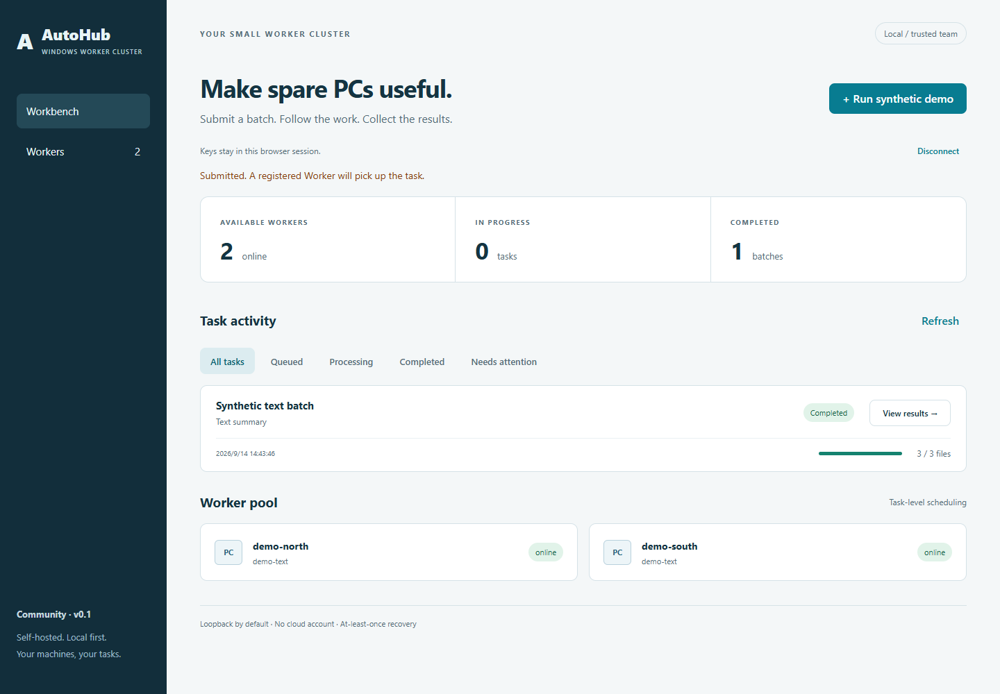

# AutoHub 社区版

**把闲置 Windows PC 变成一个自托管 Worker 集群。**

当前为未发布候选。真实本机 Demo、SQLite 文件闭环、两 Worker 超时接管、单项重试和 UI 已验证；干净普通账户验收与 GitHub CI 尚未完成，不能视为正式发行版。



使用 Node.js 22.23.2 x64，在候选根目录运行：

```powershell
npm ci --registry=https://registry.npmjs.org
npm run build
npm run demo
```

Demo 创建独立临时目录和随机密钥，启动真实 Server 与独立 Worker，生成并上传合成文本，验证结果。打开终端显示的本机地址，输入临时 browser key。Ctrl+C 停止并清理。只需命令行验收时运行 `npm run demo:smoke`。

长期本地工作区：先 `npm run setup`，然后分别在两个终端运行 `npm start` 与 `npm run worker -- .local/config.json demo-worker`。浏览器访问 http://127.0.0.1:43170，使用配置中的 browserKey。

核心能力：SQLite 原子领取、任务和条目状态、Worker 注册/心跳、15 秒超时回收、失败条目重试、本地结果下载、只读本机诊断。调度按任务分配，不宣称自动把单个任务跨机分片。超时恢复可能重复执行，是 at-least-once；有副作用的执行器必须自行保证幂等。

默认只监听本机；管理诊断始终只监听 loopback。单一共享浏览器密钥不是登录系统或 RBAC。Worker 使用独立注册密钥、进程会话和任务租约。只适用于受信任团队；不适合公网。每任务最多 16 个文件，每文件 1–65,536 字节。客户端不能指定命令或本地路径。

详见 [英文完整说明](README.md)、[架构](docs/architecture.md)、[配置](docs/configuration.md)、[执行器接口](docs/executor-api.md)、[排错](docs/troubleshooting.md)、[安全边界](SECURITY.md)。
